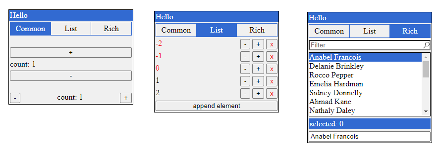

# DirtyDOM



## Example

```js

let counter = 0;
const wnd = DD.window("example", dd => {
        if (dd.button("+")) counter++
        dd.label(`count: ${counter}`);
        if (dd.button("-")) counter--
})
wnd.show()
wnd.move(100, 100);

// force to repaint when data changed
wnd.dirty()

// close window
wnd.close()

```

## Elements 

### Labels

```js
dd.label("hello");
dd.header("hello");
dd.label("");
dd.header("hello <b>world</b>!");
```

### Buttons

``` js      
if (dd.button("ok")) {
        console.log("ok clicked")
}

if (dd.button("cancel")) {
        console.log("cancel clicked")
}
```

```js
isVisible = dd.toggle(isVisible, "is visible")
```


### Selectable

```js
const strings = ["item 0", "item 1", "item 2"]

const users = [
        ["user 0", new User(0)], 
        ["user 1", new User(1)], 
        ["user 2", new User(2)]]

const objects = [
        new User(0),
        new User(1),
        new User(2)]

var selectedIndex = dd.combo(selectedIndex, strings)
var selectedIndex = dd.combo(selectedIndex, users)
var selectedIndex = dd.combo(selectedIndex, objects, 
        // string to display
        o => o.name)

var selectedIndex = dd.switcher(selectedIndex, strings)
var selectedIndex = dd.switcher(selectedIndex, users)
var selectedIndex = dd.switcher(selectedIndex, objects,
        // string to display
        o => o.name)
```

        
### Text        

```js
userName = dd.text(userName);
userDescription = dd.textarea(userDescription, 5);
```

### Filter

```js
const strings = ["item 0", "item 1", "item 2"]

let singleIndex = 0;
let multiSelect = []

singleIndex = dd.filter(singleIndex, strings);
multiSelect = dd.filter(multiSelect, strings);
```


```js
let objectIndex = 0;
const objects = [
        new User(0),
        new User(1),
        new User(2)]

objectIndex = dd.filter(objectIndex, objects,
        // string to display
        u => u.name, 
        // filter object
        (i, u) => u.name.indexOf(i) != -1);
```


## Layout

```js
dd.vBox(dd => {
        // align vertical inside callback
        dd.button("v")
        dd.button("v")
        dd.button("v")
})

dd.hBox(dd => {
        // align horizontal inside callback
        dd.button("h")
        dd.button("h")
        dd.button("h")
})

// insert space
dd.space()

// insert horizontal or vertical line
dd.hr()

// insert flexible space
dd.expand();
```

## Styles

```js
// append css-style to next element
dd.pushStyle('color', 'red')
dd.button('red button')
dd.button('regular button')
```